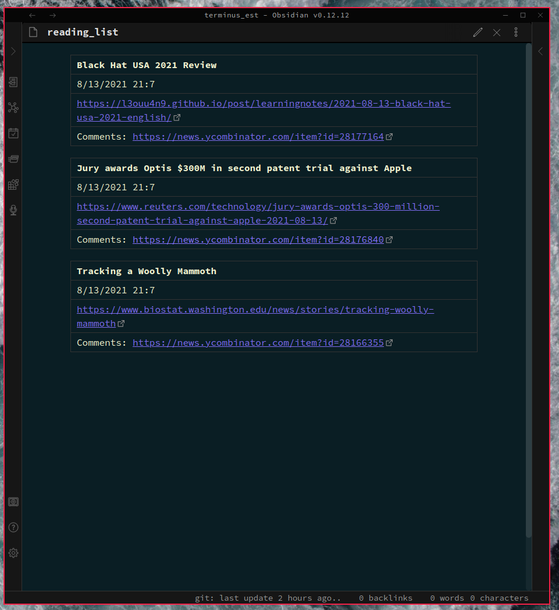
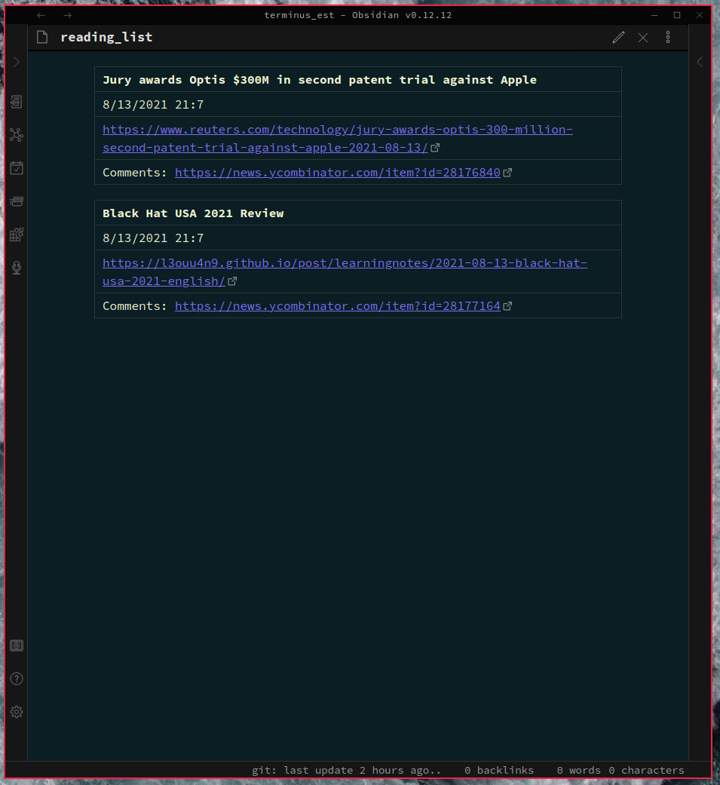

# *hypermark*

Bookmarks; improved.

I often find myself bookmarking articles to read later, only for them to be lost in the *endless void* that is the typical browser's bookmark system.
The default bookmark systems of web browsers can quickly get crowded and inefficient. Furthermore, they are often covered up by layers of proprietary code, which can make it difficult to extend the systems in ways that are more in line with your workflow.

Enter hypermark.

Features:
- hypermark is transparent and extensible through its use of plain markdown files, which allows users to easily write custom content management systems.
- hypermark persistently stores the paths to these markdown files, called **hyperpaths** in a simple, editable text file.
- hypermark relies on simple data structures called **bytemarks** which are written to files as markdown tables.
- Easily move, duplicate, delete and create bytemarks through hypermark's TUI.
- Send bytemarks between different hyperpaths.
- Save articles from the front page of Hacker News to read later.
- Save arbitrary URLs as bytemarks.
- TUI and CLI options.

Features to be added:
- YouTube integration: Reduce your dependence on YouTube's algorithms.

## Saving articles from the front page of Hacker News
So many interesting articles, so little time. hypermark let's you save articles for later reading with minimal mental overhead.

### After saving

## Managing bytemarks through the TUI
hypermark makes it easy to manage the bytemarks you've saved.

### After managing bytemarks

## Sending bytemarks to another file
Sometimes you want to keep track of the articles you've read in the past without cluttering up your reading list. hypermark makes this type of content management effortless.

### After sending bytemarks

### Creating bytemarks using arbitrary URLs
hypermark can scan any valid URL from the system clipboard and use it to create a new bytemark. The gif below shows me using this feature after copying a URL to my system clipboard, no pasting required.

## After creating bytemark 

